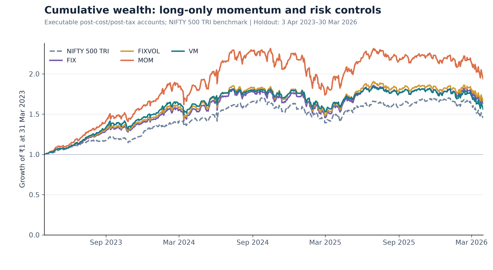
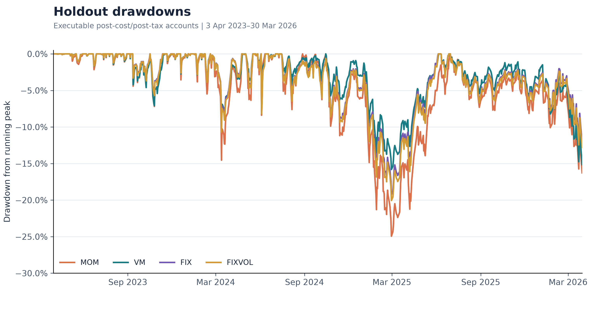

# Volatility-Managed Momentum in Indian Equities

An implementable, long-only Indian-equity adaptation of Pedro Barroso and Pedro Santa-Clara's **"Momentum Has Its Moments" (2015)**, completed for Brindco's *One Paper, One Strategy* quantitative-research case.

The original paper scales a long-short momentum portfolio down when momentum volatility is high. This project asks a narrower question under the assignment mandate: **does scaling an unlevered, long-only portfolio of NIFTY 500 winners toward a 12% volatility target improve an executable Indian cash-equity account?**

The answer is mixed. Volatility management reduced holdout volatility and drawdown, but unscaled momentum delivered the strongest growth and Sharpe ratio. Fixed-exposure controls also outperformed the dynamically scaled strategy, so lower average equity exposure explains part of VM's defensive behavior.

## Paper and strategy translation

**Selected paper:** Barroso, P. and Santa-Clara, P. (2015), *Momentum Has Its Moments*, Journal of Financial Economics 116(1), 111-120.

The assignment requires NSE-listed, fully paid cash equities; long-only positions; no leverage, derivatives, borrowing, margin funding, or overnight shorts. The paper is therefore translated as follows:

- The investable universe is reconstructed point-in-time NIFTY 500 membership.
- At each monthly formation date, momentum is the compounded total return from months *t-12* through *t-2*. The most recent month is skipped.
- Eligible securities are ranked deterministically; the top decile is held equally weighted.
- **MOM** invests fully in the winner sleeve.
- **VM** scales that sleeve using the trailing 126-session RMS volatility of an unscaled shadow momentum portfolio:

  ```text
  sigma_hat = sqrt((252 / 126) * sum(last 126 shadow daily returns^2))
  target equity exposure = min(1, 0.12 / sigma_hat)
  ```

- **FIX** uses constant equity exposure equal to VM's mean development-period target.
- **FIXVOL** uses a constant development-calibrated exposure intended to match VM's overall volatility without dynamic timing.
- Unallocated capital remains in cash and earns 0%.

All four accounts use the same winners, execution engine, liquidity constraints, settlement, costs, corporate-action logic, whole-share rules, and FIFO tax accounting. [METHODOLOGY.md](METHODOLOGY.md) contains the complete specification and every material deviation from the paper.

## Research design

| Item | Specification |
|---|---|
| Development window | 1 April 2015 to 31 March 2023 |
| Holdout window | 3 April 2023 to 30 March 2026 |
| Universe | Point-in-time NIFTY 500 constituents |
| Rebalance | Monthly |
| Selection | Top 10% of eligible securities by 12-to-2 momentum |
| Positioning | Equal weight within the winner sleeve |
| Liquidity | Maximum 1% of preceding 20-session rupee ADV per security per day |
| Trading | Whole shares at the next eligible session's raw open; orders expire after five NSE sessions |
| Settlement | Conservative T+2 settlement-business-day availability |
| Taxes | FIFO; 20% STCG; 12.5% LTCG above the annual INR 125,000 exemption |
| Benchmark context | NIFTY 500 Total Return Index |

The holdout accounts continue from their frozen 31 March 2023 closing states. No signal, ranking, sizing, cost, tax, or execution parameter was changed in response to holdout performance.

## Trading arithmetic before performance ratios

The table reports the realized holdout implementation arithmetic. Gross turnover counts buys and sells; round-trip-equivalent turnover is half that amount. Effective round-trip cost is the annualized implementation-cost drag divided by round-trip-equivalent turnover. The hurdle is implementation-cost drag plus tax drag. Gross edge is the CAGR of the matched executable path with recorded costs and tax effects reversed, relative to the model's 0%-return cash comparator.

| Account | Annual gross turnover | RT-equivalent turnover | Effective RT cost | Cost drag | Tax drag | Cost + tax hurdle | Gross annual edge | Clears hurdle? |
|---|---:|---:|---:|---:|---:|---:|---:|:---:|
| MOM | 5.34x | 2.67x | 50.4 bps | 1.34% | 2.74% | 4.09% | 28.80% | Yes |
| VM | 4.73x | 2.37x | 47.2 bps | 1.12% | 2.42% | 3.54% | 19.59% | Yes |
| FIX | 4.92x | 2.46x | 45.9 bps | 1.13% | 2.38% | 3.51% | 21.31% | Yes |
| FIXVOL | 5.12x | 2.56x | 46.4 bps | 1.19% | 2.47% | 3.66% | 22.10% | Yes |

Costs include statutory charges and participation-dependent market impact. The declared impact curve is `10 bps * max(1, sqrt(participation / 0.001))` per side, evaluated using lagged ADV. Taxes and transaction costs are applied inside the account rather than deducted from headline results afterward.

## Results

### Development period

| Account | CAGR | Annual volatility | 0%-cash Sharpe | Max drawdown |
|---|---:|---:|---:|---:|
| MOM | 8.86% | 20.30% | 0.53 | -38.32% |
| VM | 5.05% | 14.23% | 0.42 | -34.42% |
| FIX | 6.81% | 13.50% | 0.56 | -27.00% |
| FIXVOL | 7.11% | 14.19% | 0.56 | -28.31% |

### Holdout period

| Account | Final NAV | CAGR | Annual volatility | 0%-cash Sharpe | Max drawdown |
|---|---:|---:|---:|---:|---:|
| MOM | INR 38.23m | 24.71% | 21.05% | 1.17 | -24.94% |
| VM | INR 23.17m | 16.05% | 15.08% | 1.08 | -15.81% |
| FIX | INR 27.68m | 17.80% | 16.09% | 1.12 | -19.22% |
| FIXVOL | INR 28.77m | 18.45% | 16.82% | 1.11 | -20.05% |

The NIFTY 500 TRI returned a 13.23% CAGR over the holdout. Final NAVs are not directly comparable because the accounts enter the holdout with different frozen closing wealth; CAGR and normalized wealth paths are the appropriate comparisons.





The concise numerical outputs are [results/development_summary.csv](results/development_summary.csv) and [results/holdout_summary.csv](results/holdout_summary.csv). The five-page submission memo is available at [results/brindco_project_memo.pdf](results/brindco_project_memo.pdf).

## Data sources and validation

All inputs come from free public sources:

- official NSE equity bhavcopy archives;
- official NIFTY 500 constituent and index-review notices;
- NSE corporate-action records and exchange announcements;
- contemporaneous company filings for material special cases;
- official NSE trading/settlement information; and
- the published NIFTY 500 TRI series.

The compact repository ships the accepted processed inputs needed for an exact replay. The much larger raw archive is omitted; [data/raw/OMITTED_SOURCE_MANIFEST.csv](data/raw/OMITTED_SOURCE_MANIFEST.csv) records source URLs, dates, hashes, sizes, and purposes.

Free Indian-market data are not assumed clean. The pipeline uses dated membership rather than today's constituent list, maintains permanent security identity through symbol changes, distinguishes cash-equity series from entitlement securities, checks pre-listing membership, validates corporate actions against primary evidence, and keeps missing returns, volume, quotes, and liquidity visibly unavailable rather than replacing them with zero or future information.

## Reproduce from a clean checkout

Python 3.12 is recommended. From the repository root:

```powershell
python -m venv .venv
.venv\Scripts\python.exe -m pip install -r requirements.lock.txt
.venv\Scripts\python.exe scripts\reproduce.py
.venv\Scripts\python.exe -m pytest -q
```

On macOS or Linux, replace `.venv\Scripts\python.exe` with `.venv/bin/python`.

The reproduction command rebuilds monthly features, winner sets, shadow returns, the volatility overlay, all four development accounts, all four holdout accounts, both summary tables, and the final figures. It then removes bulky generated ledgers after validating the submitted metrics. The chronological replay is CPU intensive and may take more than an hour on a laptop. Dependency versions are pinned, selection and execution tie-breaks are deterministic, and identical inputs produce identical submitted outputs.

## Repository guide

```text
data/processed/          Accepted reproducibility boundary and runtime inputs
data/raw/                Provenance manifest for omitted public archives
src/brindco_momentum/    Signals, portfolios, execution, tax and evaluation code
scripts/reproduce.py     Single end-to-end entry point
tests/                   Compact financial and data-invariant regression suite
results/                 Final summaries, memo and publication figures
```

## Limitations

- This is a long-only winners-plus-cash adaptation, not a replication of the paper's leveraged long-short portfolio.
- Daily bars cannot prove opening-auction fills or intraday order-book depth; participation and impact remain declared approximations.
- The holdout contains 742 sessions but only 36 monthly decisions, limiting statistical inference.
- Uniform T+2 settlement and per-account tax treatment simplify some historical and investor-specific details.
- One immaterial UPL fractional bonus claim remains unpriced and excluded from NAV rather than assigned an invented value.

See [LIMITATIONS.md](LIMITATIONS.md) for the full discussion.

## Use of AI tools

AI tools were used during the development and coding process. The methodology, assumptions, implementation, and results were reviewed and can be explained and defended independently.
